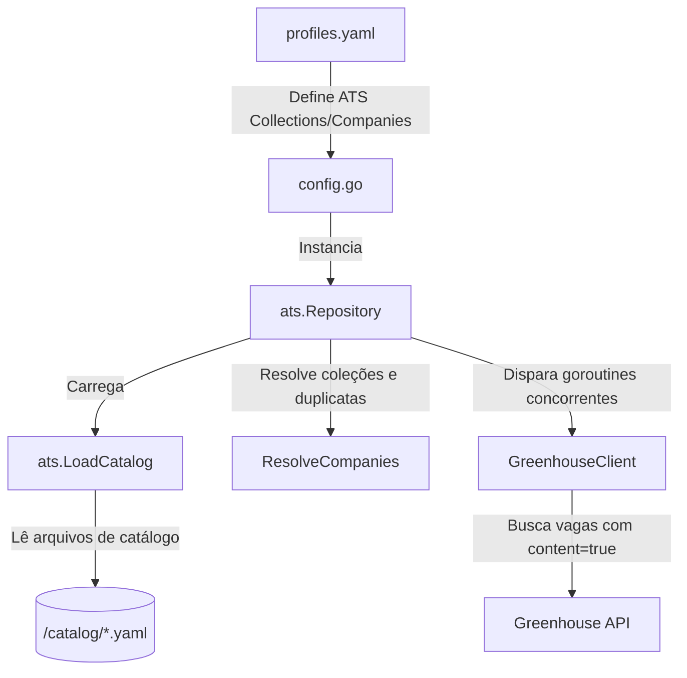

# Guia de Suporte a Provedores ATS (Applicant Tracking Systems)

Este guia descreve a arquitetura do suporte nativo a provedores de ATS no **Jobs Bot** e ensina como gerenciar o catálogo de empresas e adicionar suporte a novos provedores (como Greenhouse, Lever, Ashby, etc.).

---

## 🏗️ Visão Geral da Arquitetura

O bot utiliza uma abordagem baseada em catálogo estruturado em arquivos YAML localizados no diretório `/catalog`. A integração é orquestrada pela camada de infraestrutura sob `internal/infrastructure/providers/ats/`.



O `ats.Repository` implementa o `domain.JobRepository` e orquestra a busca concorrente em todas as APIs de ATS configuradas para o perfil.

---

## 📁 Estrutura de Arquivos

- **`/catalog/`**
  - `collections.yaml`: Mapeia coleções/categorias (ex: `remote-ai`, `fintech`) para IDs de empresas correspondentes.
  - `greenhouse.yaml`: Lista de empresas hospedadas no Greenhouse ATS, contendo seus nomes amigáveis, tokens da board e metadados.
  - `lever.yaml` / `ashby.yaml`: Espaços reservados para futuros provedores.
- **`internal/infrastructure/providers/ats/`**
  - `catalog.go`: Lógica para carregamento do catálogo e resolução de coleções.
  - `client.go`: Definição da interface padrão `AtsClient`.
  - `repository.go`: Orquestrador concurrente e resiliente de chamadas às APIs de ATS.
  - `greenhouse/`: Implementação nativa do cliente Greenhouse.

---

## ➕ Como Adicionar uma Empresa ao Catálogo

Se uma empresa utiliza o Greenhouse e você quer que o bot monitore as vagas dela:

1. Obtenha o **Board Token** da empresa na Greenhouse (ex: para `https://boards.greenhouse.io/openai`, o token é `openai`).
2. Abra o arquivo `catalog/greenhouse.yaml` e insira o registro sob a seção `companies`:

```yaml
companies:
  huggingface:
    name: "Hugging Face"
    board_token: "huggingface"
    country: "US"
    remote_friendly: true
    categories: ["AI", "Open Source"]
    career_page_url: "https://huggingface.co/joinus"
```

3. Se desejar incluí-la em uma coleção existente, edite o arquivo `catalog/collections.yaml`:

```yaml
collections:
  remote-ai:
    - openai
    - anthropic
    - huggingface  # Nova adição
```

---

## 🛠️ Como Adicionar Suporte a um Novo Provedor ATS (Ex: Lever)

Para adicionar um novo provedor como Lever ou Ashby:

### Passo 1: Criar o Cliente do Provedor
Crie o diretório `internal/infrastructure/providers/ats/lever/` e implemente o cliente que atende à interface `AtsClient`:

```go
package lever

import (
	"jobs-bot/internal/domain"
)

type LeverClient struct {
	apiKey string
}

func NewClient(apiKey string) *LeverClient {
	return &LeverClient{apiKey: apiKey}
}

func (c *LeverClient) FetchJobs(boardToken string) ([]domain.Job, error) {
	// 1. Chamar a API pública do Lever (ex: https://api.lever.co/v0/postings/{boardToken}?mode=json)
	// 2. Mapear o payload do Lever para []domain.Job
	// 3. Retornar os resultados
}
```

### Passo 2: Registrar no Orquestrador
Abra `internal/infrastructure/providers/ats/repository.go` e atualize o construtor `NewRepository` e o método `FetchJobs`:

1. Adicione o cliente do novo provedor à struct `Repository`:
```go
type Repository struct {
	catalogDir       string
	greenhouseClient AtsClient
	leverClient      AtsClient // Novo
	requestedAts     config.AtsConfig
}
```

2. Instancie o cliente no construtor `NewRepository`:
```go
func NewRepository(catalogDir string, cfg *config.Config, requestedAts config.AtsConfig) *Repository {
	return &Repository{
		catalogDir:       catalogDir,
		greenhouseClient: greenhouse.NewClient(cfg.GreenhouseAPIKey),
		leverClient:      lever.NewClient(cfg.LeverAPIKey), // Novo
		requestedAts:     requestedAts,
	}
}
```

3. Adicione o switch-case correspondente no `FetchJobs`:
```go
			switch company.Provider {
			case "greenhouse":
				fetched, fetchErr = r.greenhouseClient.FetchJobs(company.BoardToken)
			case "lever":
				fetched, fetchErr = r.leverClient.FetchJobs(company.BoardToken) // Novo
			default:
				fetchErr = fmt.Errorf("unsupported provider %q", company.Provider)
			}
```

### Passo 3: Criar o Catálogo YAML do Provedor
Adicione um arquivo `catalog/lever.yaml` com as configurações e tokens das empresas Lever. O nome do arquivo (ex: `lever.yaml`) determina automaticamente o valor mapeado na propriedade `Provider` das empresas resolvidas pelo parser do catálogo.
